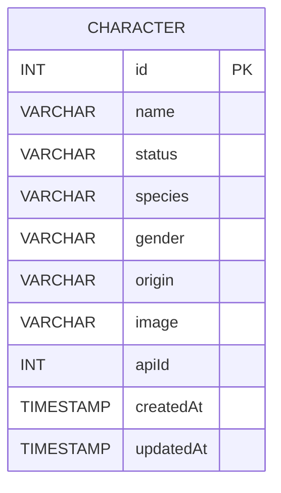

# Database ERD

> Single-table schema focused on character search & caching.  
> Optimized for filters by **status, species, gender, name, origin**.

## Column Notes

- **id**: Primary key (auto-increment).
- **name**: Character display name.
- **status**: e.g., `Alive`, `Dead`, `unknown`.
- **species**: e.g., `Human`, `Alien`, etc.
- **gender**: e.g., `Male`, `Female`, `Genderless`, `unknown`.
- **origin**: Free text (e.g., `Earth (C-137)`).
- **image**: Optional avatar URL.
- **apiId**: Unique external ID (prevents duplicate imports).
- **createdAt / updatedAt**: Managed by Sequelize.

## Indexing (Recommended)

- B-Tree on: `status`, `species`, `gender` (equality filters).
- B-Tree on: `origin` (partial match support with `ILIKE '%term%'` in Postgres).
- B-Tree on: `name` (used by search).
- Unique index on: `apiId`.

## Rationale

A single **Character** table is sufficient for the current API surface (filters & list/detail).
Relationships can be introduced later (e.g., Episodes, Locations) without breaking the existing schema.
